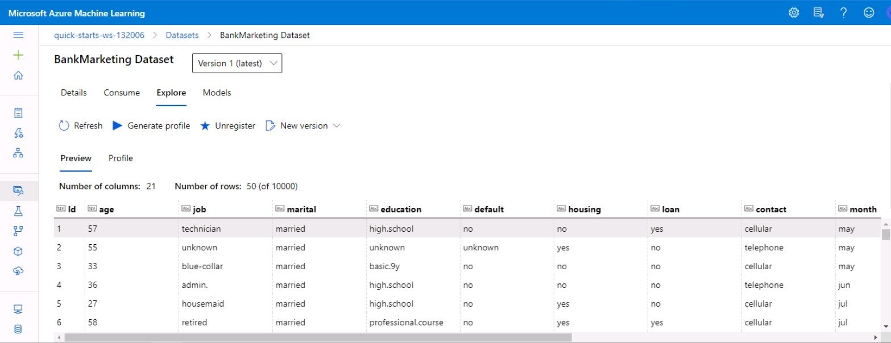
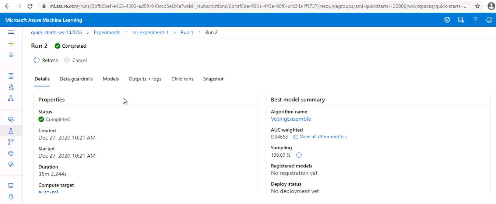
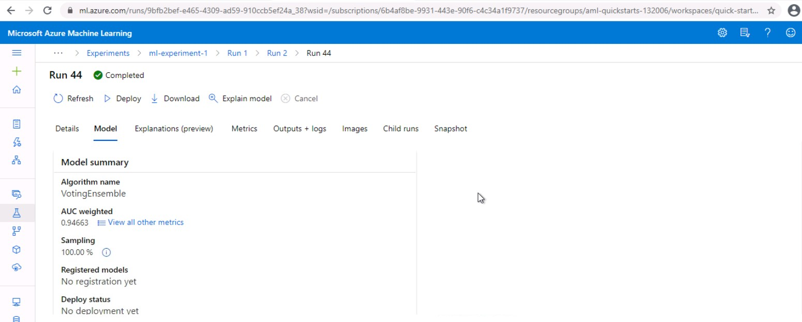
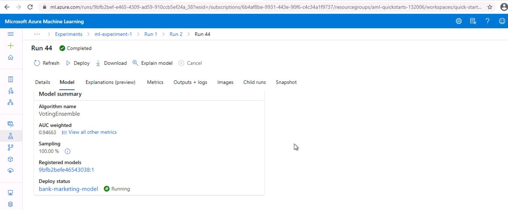
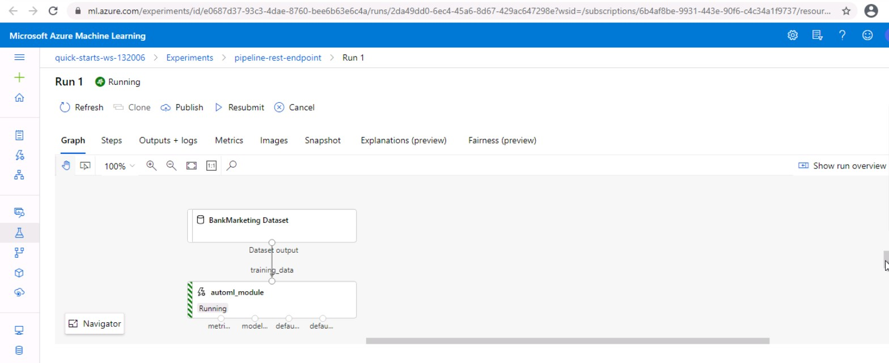

# Operationaliing Machine Learning

This project is part of the Udacity's Azure ML Engineer Nanodegree. The aim of this project is to create, publish and consume a Microsoft Azure pipeline. For this pipeline we use a machine learning model generated using Azure Automated ML experiment. We deploy this model to create an HTTP API endpoint. We consume this endpoint by sending HTTP POST request to this endpoint.

## Summary of dataset
This dataset contains data about customers who are contacted to market banking products. We seek to predict if the customer will buy the product. The dataset has 21 columns out of which 20 are used as input features and 1 target column. Input features include information about customer such as age, job type, marital status, education, housing, information about contacts made with customer, outcome of previous campaign etc. Target column indicates if the customer has subscribed to term deposit. Possible values of target column are yes / no.

## Architectural Diagram

## Key Steps
###	The first step is automated ML experiment. We execute this step using a Jupyter notebook. Initially we create a new compute cluster of type Standard_DS12_V2.

###	Then we create an Azure dataset for the bank marketing data that is available in public domain.

###	We create an automated ML run for a classification experiment providing automlconfig and automlstep. The run is submitted. It generates and tests a number of machine learning models. 

###	Upon completion of the Automated ML experiment, we get a summary of machine learning models generated. Also, we get the best model of the run. The best model generated in our case is MaxAbsScaler,LightGBM with metric AUC Weighted = 0.94505

###	The next step is to deploy the best model. We deploy this model using Azure Container Instance. This gives us a model endpoint which can be consumed using REST endpoint and Primary key.

#### Check Deploy Status = Running

#### Check REST endpoint and Primary key

###	We need logs for the run. So we use a python script logs.py to enable Application Insights which lets us retrieve log files. 
#### Check Application Insights enabled = True

###	The next step is Swagger documentation. We use a script swagger.sh to run an instance of swagger container on port 9000. Then we use a python script serve.py to run a Python server on port 8000. It needs a file swagger.json in the same directory. We use a browser to interact with the swagger instance running with the documentation for the HTTP API of the model.

###	The next step is to consume model endpoints. We use scoring URI and key of the deployed model to execute a Python script endpoints.py. This script sends a sample POST request to the model. 

###	The next step is to benchmark the model. We use a script benchmark.sh that uses Apache benchmark. The output contains information for Requests per second, time per request etc.

###	The next step is to create, publish and consume a pipeline. We again use the Jupyter notebook for this purpose.  It creates and publishes a pipeline. 

###	We can view the progress of the pipeline using Use Run Details widget

## Screen Recording
Please use following link to watch the video:
https://youtu.be/SYy_Lm7bFPo

## Future Improvements
* We can download the model by creating a Docker image and test it with a local container using model packaging.
* We can export our model to ONNX (Open Neural Network Exchange) format which can help optimize the inference or scoring of the model. Models in ONNX format can be run on a variety of platforms and devices. We can use them to get optimal performance across platforms, and not just on Azure platform.
