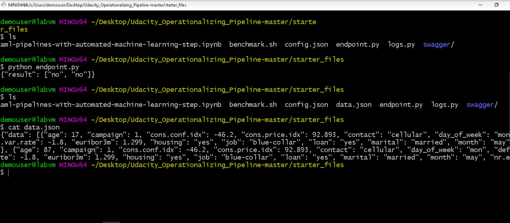

# Operationalizing Machine Learning

This project is part of the Udacity's Azure ML Engineer Nanodegree. The project is executed in two parts. In the first part of the project we create and run an Azure Automated ML experiment as part of a machine learning pipeline. We retrieve the best machine learning model generated by this experiment and deploy it. In the second part of this project we publish the pipeline to create an HTTP API endpoint. Then we consume this endpoint by sending an HTTP POST request.

## Summary of dataset
This dataset contains data about customers who are contacted to market banking products. We seek to predict if the customer will buy the product. The dataset has 21 columns out of which 20 are used as input features and 1 target column. Input features include information about customer such as age, job type, marital status, education, housing, information about contacts made with customer, outcome of previous campaign etc. Target column indicates if the customer has subscribed to term deposit. Possible values of target column are yes / no.

## Architectural Diagram

## Key Steps
###	1. Automated ML Experiment
The first step is automated ML experiment. We execute this step using a Jupyter notebook. 

#### Compute Cluster
Initially we create a new compute cluster of type Standard_D2_V2.

#### Dataset
Then we create an Azure dataset for the bank marketing data that is available in public domain.

#### Automated ML Run
We create an automated ML run for a classification experiment providing automlconfig and automlstep to a new pipeline. The pipeline run is submitted. It generates and tests a number of machine learning models. We can check the progress of the pipeline in Azure Studio using View Run Details widget

#####	Progress of pipeline using View Run Details widget

##### Best Model	
Upon completion of the Automated ML experiment, we get a summary of machine learning models generated. Also, we get the best model of the run. The best model generated in our case is VotingEnsemble with metric AUC Weighted = 0.94663

##### Check Status = Completed and Best Model Summary

###	2. Deploy Best Model
We deploy this model using Azure Container Instance. This gives us a model endpoint which can be consumed using REST endpoint and Primary key.

##### Check Deploy Status = Running

##### Check REST endpoint and Primary key

###	3. Consume model endpoint 
We need to consume model endpoint. We use REST endpoint(scoring URI) and Primary key of the deployed model to execute a Python script endpoints.py. This script sends a sample POST request to the model. We get output in the format:
{"result":["no","no"]}

Also, it creates a file data.json.

##### Check output of endpoints.py and data.json in directory listing

###	4. Logging using Application Insights
We need logs for the run. So we use a Python script logs.py to enable Application Insights which lets us retrieve log files. 
##### Check Application Insights enabled = True

###	5. Swagger documentation 
We use a script swagger.sh to run an instance of swagger container on port 9000. Then we use a Python script serve.py to run a Python server on port 8000. It needs a file swagger.json in the same directory. We use a browser to interact with the swagger instance running with the documentation for the HTTP API of the model.

###	6. Benchmark the model
We use a script benchmark.sh that uses Apache benchmark. The output contains information for Requests per second, time per request etc.

###	7. Publish and consume model pipeline
We again use the Jupyter notebook for this purpose.  First, we publish the pipeline of our Automated ML experiment to create an HTTP API endpoint. 

##### Pipeline published in Jupyter Notebook

##### REST Endpoint of published pipeline

Then we consume this pipeline as follows:

* We retrieve the authentication header so that the endpoint can be used. 
* We get the REST url from the endpoint property of the published pipeline object.
* We build an HTTP POST request to the endpoint along with a JSON payload. 
* We make a request to trigger the run. We can use the run id to monitor the status of the new run. 

##### Pipeline consumed and submitted

##### New pipeline run with Status = completed

## Screen Recording
Please use following link to watch the video:
https://youtu.be/u-GwT1VRtYo

## Future Improvements
* We can test the best model generated by automated ML run using test data and check confusion matrix.
* We can download the model by creating a Docker image and test it with a local container using model packaging.
* We can export our model to ONNX (Open Neural Network Exchange) format which can help optimize the inference or scoring of the model. Models in ONNX format can be run on a variety of platforms and devices. We can use them to get optimal performance across platforms, and not just on Azure platform.
